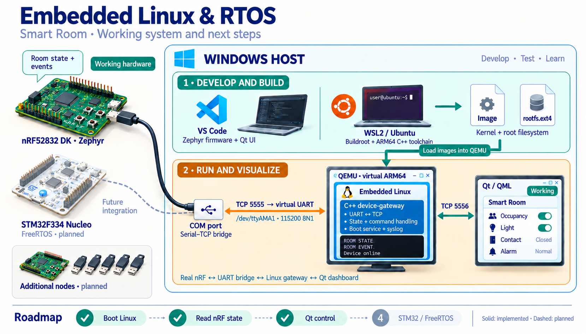

# Embedded Linux & RTOS

A device-control project connecting **Buildroot Linux on ARM64**, **Zephyr on a
physical nRF52832**, and a **Windows Qt/QML interface**.

The current application is Smart Room: physical buttons change occupancy,
light, contact and alarm state. The dashboard displays that state and can
request a light change. The firmware remains the authority for device state.



## Embedded Linux

- Buildroot 2025.02.18, ARM64 `virt` target under QEMU, with Linux 6.12.27.
- C++17 gateway using standalone Asio: serial framing, protocol parsing,
  device-state tracking and a single-client TCP server.
- Heartbeat monitoring, explicit command outcomes and stale-state handling.
- Buildroot external tree, automatic SysV service startup and Linux syslog.
- Native protocol/controller tests and integration tests using a pseudo-UART.

## Zephyr RTOS

- Real nRF52832 DK (`nrf52dk/nrf52832`), with GPIO button/LED abstraction.
- Separate room-domain, protocol, indicator and diagnostic responsibilities.
- Multiple threads, zbus state/event distribution and a command message queue.
- Bidirectional UART protocol; RTT is used for diagnostics.

## Qt/QML interface

The Windows dashboard displays room state and gateway connectivity, sends light
commands and shows their outcomes. See the [GUI overview and screenshot](desktop-ui/README.md).

## Try it

**Without hardware:** run the Linux gateway's native tests. The integration test
creates a pseudo-terminal and a simulated protocol peer; no QEMU or nRF is needed.

```sh
cmake -S embedded-linux -B build/native -DBUILD_TESTING=ON
cmake --build build/native --parallel 4
ctest --test-dir build/native --output-on-failure
```

**Complete system:** follow [Setup](doc/setup.md) for firmware, Buildroot, SSH
provisioning, image transfer and Qt. Linux builds belong in WSL's Linux filesystem;
firmware and Qt development remain on Windows.

| Directory | Responsibility |
|---|---|
| `embedded-linux/` | Linux application, tests and Buildroot integration |
| `firmware/zephyr-smart-room/` | Zephyr application and UART helper tests |
| `desktop-ui/` | Qt networking/view model and QML interface |
| `tools/qemu/` | Windows QEMU startup and serial bridge |
| `doc/` | Architecture, protocol, setup and verification |

## Behavior and limits

The gateway pings every two seconds and marks the device offline after six
seconds without a valid reply. A light command needs an ACK and confirming
state; a three-second timeout means the outcome is unknown, with no automatic
command replay. Qt reconnects and disables control until current state is valid.

Linux runs in QEMU, not on the nRF. The GUI runs on Windows, not on an embedded
display. This is a development prototype, not a production-hardened product.
It is not evidence of custom kernel-driver development or real-time performance
on physical ARM64 hardware. The TCP protocol has no authentication or encryption;
Windows forwarding and the UART bridge bind to loopback for local development.

See [Architecture](doc/architecture.md), [Protocol](doc/protocol.md), and
[Verification](doc/verification.md). CI covers native Linux and Python tests;
physical-board tests and the complete image/GUI remain separate validation steps.

## Future work

An interactive device simulator, STM32/FreeRTOS integration and deployment to
a physical Linux-capable board are possible next steps; they are not implemented.

## Source and licensing

This repository brings together the current Linux, firmware and desktop sources.
The firmware was imported as a source snapshot from
[muoro/firmware](https://github.com/muoro/firmware); its original repository retains
the earlier history. See [Licensing](LICENSE) and [Third-party notices](THIRD_PARTY.md).
