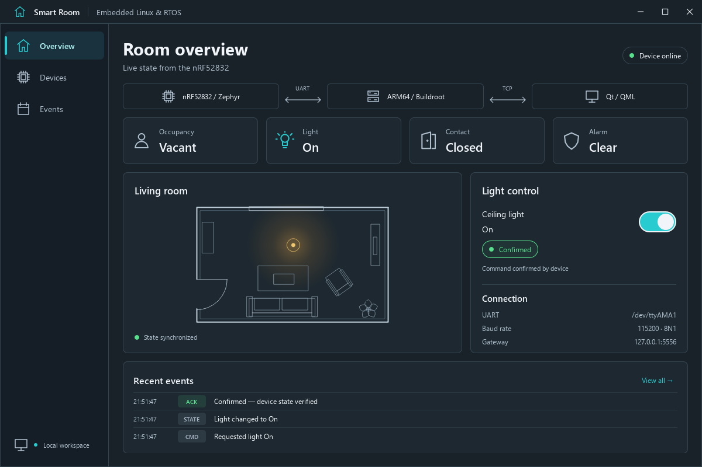

# Qt/QML dashboard



Screenshot of the Qt application using a local protocol test peer. It demonstrates
the interface; it is not evidence of a physical-board test.

Windows Qt **6.8.3 MinGW 64-bit**, matching **MinGW 13.1**, CMake and Ninja were
used for the development baseline. `build.ps1` accepts `QT_ROOT` and `MINGW_ROOT`
environment overrides instead of requiring these installations in fixed locations.

```powershell
.\build.ps1 -Run
```

The dashboard connects to `127.0.0.1:5556`. `GatewayConnection` owns the socket and
reconnect timer; `GatewayProtocol` parses messages; `RoomViewModel` exposes state
to QML. The UI is a Windows application, separate from the Linux image.

The dark dashboard follows the approved visual design, with room status cards,
a floor plan, confirmed light control, connection information and recent events.
The window starts at up to 1200 × 800, fits the available screen and can be moved
and resized using its title bar and edges. At smaller sizes, the sidebar becomes
icon-only and the content stacks vertically with mouse-wheel scrolling. The
minimum size is 640 × 440. The GUI executable does not open a console window.

## Component structure

| Component | Responsibility |
| --- | --- |
| `GatewayConnection` | TCP socket and reconnect timer |
| `GatewayProtocol` | Parse and encode protocol messages |
| `RoomViewModel` | Device state, command availability and outcomes |
| `EventListModel` | Timestamped, categorized events, bounded to 60 entries |
| `Theme.js`, `LineIcon` | Shared colors and scalable vector icons |
| `StatCard`, `RoomMap`, `RoomControl`, `EventPanel` | Reusable presentation components |
| `TitleBar`, `ResizeHandles`, `ScrollablePage` | Window interaction and scrolling |

The light switch displays reported device state. Clicking sends a request;
pending commands disable further input until a gateway result arrives.
Disconnected values remain visible as stale, and control is disabled.

To include tests, configure with `-DBUILD_TESTING=ON` using the same Qt/MinGW kit,
then build and run `ctest --test-dir build --output-on-failure` with the Qt and
MinGW `bin` directories on PATH. Qt Test must be installed. Tests use offscreen
rendering and a local TCP peer, without physical hardware.
